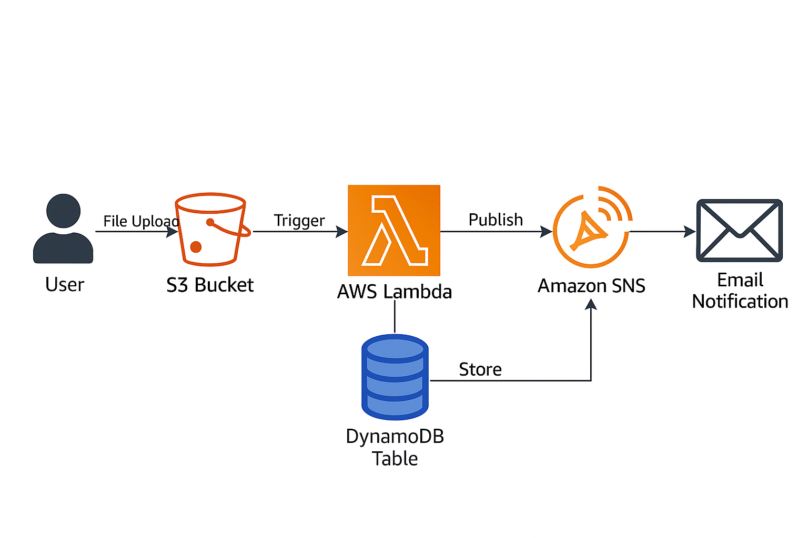

# serverless-app
✅Week 6 Mentorship Project – Group B

✅GROUP B TEAM: Fagoroye Sanumi O.
                 & Lawal Jonathan
               
**TOPIC**: Build a Complete Serverless Application using AWS Lambda

📄 **Serverless File Upload App – Scaling and Failure Handling Summary**

This project is a simple but powerful serverless application built with AWS services. The idea is straightforward: when a user uploads a file to an S3 bucket, a Lambda function is triggered. That function logs the file’s metadata to DynamoDB and notifies a user via email using SNS.

Below is an overview of how this app scales to handle larger loads and how it deals with errors when things don’t go as planned.

⚙️ **How the App Works**

Here’s what happens behind the scenes:

A file is uploaded to an Amazon S3 bucket.

S3 triggers a Lambda function automatically.

The Lambda function:

Reads file info (like the name and time of upload)

Saves that info into a DynamoDB table

Publishes a message to an SNS topic

SNS sends an email notification to the user.

CloudWatch logs everything and helps with monitoring or debugging if something goes wrong.

📈 **How the App Scales**

One of the best parts of this design is that it’s built entirely on serverless, managed services — which means AWS takes care of all the scaling for you.

**S3**

Amazon S3 can handle a huge number of file uploads per second.

It scales automatically and reliably, with very high availability.

**Lambda**

AWS Lambda spins up as many copies as needed — one per event.

This means if 1,000 files are uploaded at once, Lambda can process them in parallel (within service limits).

You don’t need to configure or manage any servers.

**DynamoDB**

The table uses on-demand capacity, so it scales up (and down) based on how many write requests it gets.

It’s highly performant, even under heavy traffic.

**SNS**

Amazon SNS can fan out messages to multiple subscribers, instantly.

It’s a good fit for alerting because it can send messages in near real time, even under large bursts.

**CloudWatch**

All logs and metrics are captured automatically.

You can scale monitoring and create alarms without worrying about infrastructure.

🛡 **How It Handles Failures**

Things go wrong. That’s expected. This app is designed to handle common failures gracefully:

**Lambda Errors**

The Lambda function wraps its logic in a try/except block.

If something fails (like DynamoDB being unavailable), it logs the error to CloudWatch.

AWS can also automatically retry the Lambda (for some triggers).

**DynamoDB**

DynamoDB is reliable, but if a write fails, the error is caught and logged.

This can later be routed to a Dead Letter Queue (DLQ) or retried manually.

**SNS Delivery Issues**

For email delivery, SNS tries for a while, but eventually drops undeliverable messages.

If your email subscription isn’t confirmed, you won’t receive alerts — but the Lambda will log that failure.

**S3 Event Duplication**

S3 guarantees at-least-once delivery, so your Lambda might get the same event more than once.

It’s best to make your Lambda function idempotent — meaning it won’t break if it processes the same file twice.

**Logging and Alerts**

Everything that happens (or fails) is logged to CloudWatch Logs.

You can set up CloudWatch Alarms to get notified if, say, the Lambda function fails multiple times in a row.

**Security and Isolation**

IAM Roles follow least privilege:

Lambda only has access to S3 read, DynamoDB write, SNS publish.

Environment variables securely pass table/topic names.

No hard-coded secrets.

